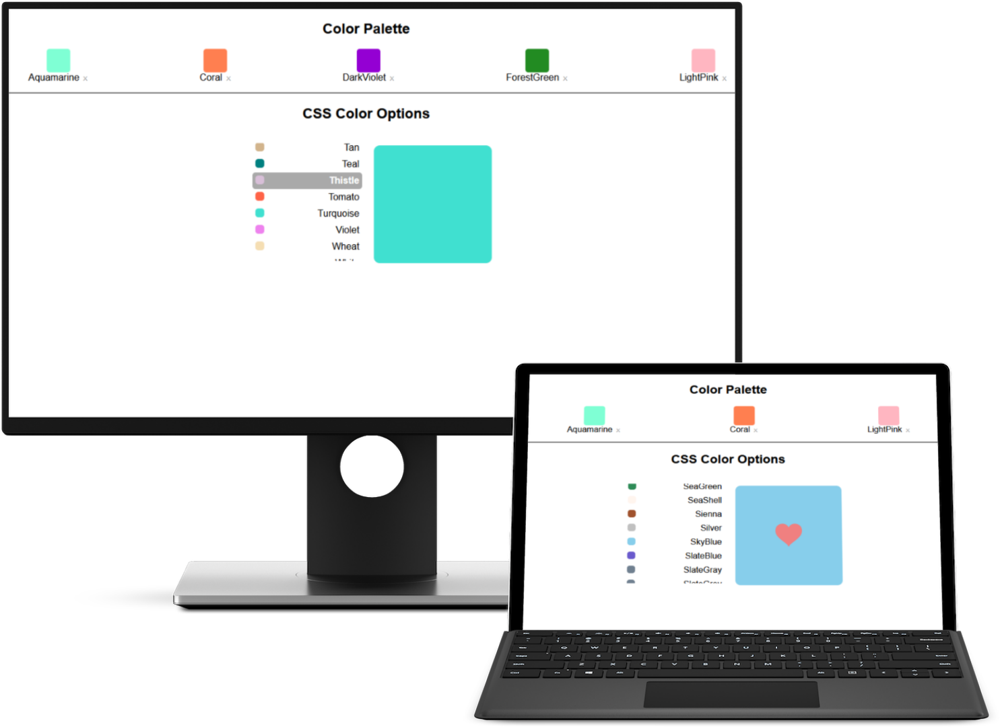

# Color Palette Selector

An interactive UI that allows the user to customize a color palette with the addition and deletion of desired colors.

## Project Details

Finalize the Seperation of Concerns (SoC) by importing the presentational components and rendering them with props.

### View My Project : [https://8eicou.csb.app/](https://8eicou.csb.app/)

## Features

- Select a desired color from a list of options
- The selected color appears in a preview window
- Add the color to the palette by clicking the favorites icon
- Discern if the color is already in the palette by the favorites icon
- Delete a color from the palette by clicking the X

## Technologies Used

- React
- CSS3
- JSX

## Ackowledgements

Project Idea: [Skillcrush](https://Skillcrush.com)

Original CSS and React components provided by: [Skillcrush](https://Skillcrush.com)